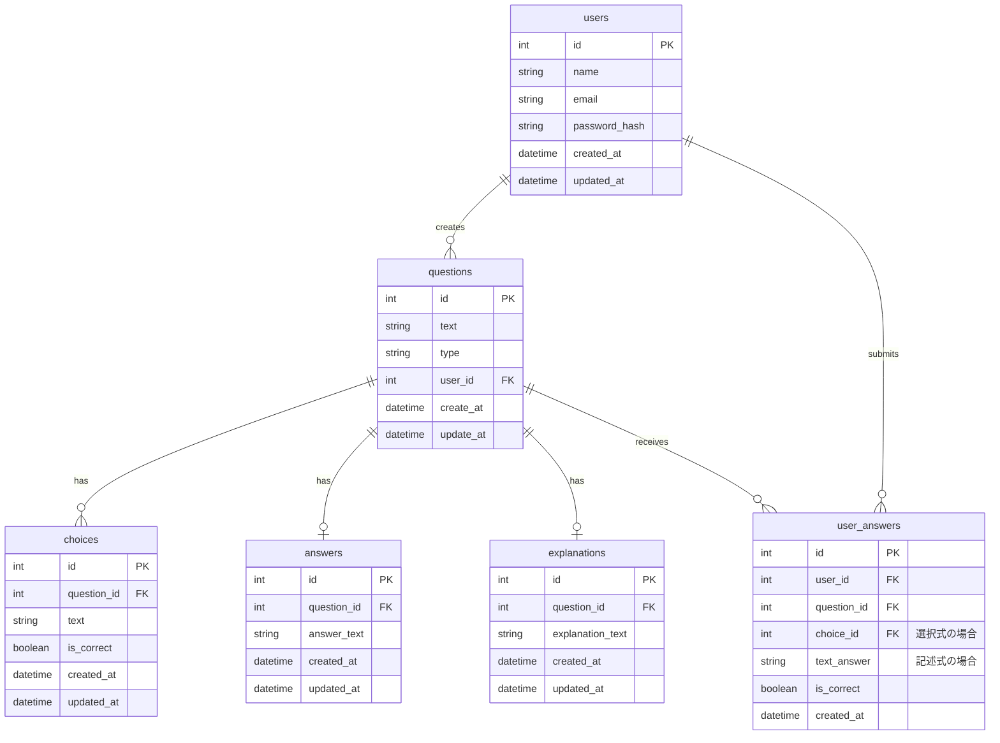

# データベーススキーマ

## テーブル詳細

### questions

-   問題を管理するテーブル
-   `type`は'multiple_choice'または'text'
-   `user_id`は作成者の ID

### choices

-   選択式問題の選択肢を管理
-   `is_correct`は正解の選択肢を示す
-   各問題に複数の選択肢が紐づく

### answers

-   記述式問題の解答を管理
-   各問題に 1 つの解答が紐づく

### explanations

-   問題の解説を管理
-   各問題に 1 つの解説が紐づく

### users

-   ユーザー情報を管理
-   問題の作成者情報を保持

### user_answers

-   ユーザーの回答履歴を管理
-   選択式と記述式の両方の回答に対応
-   正誤情報も保持
