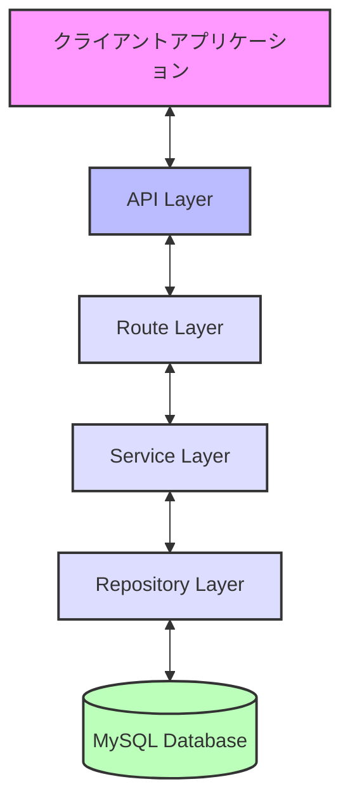
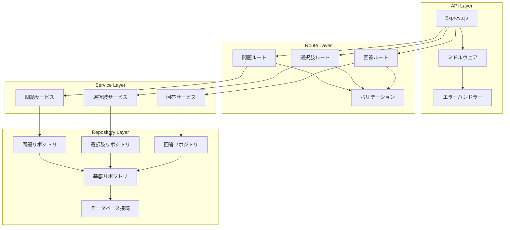
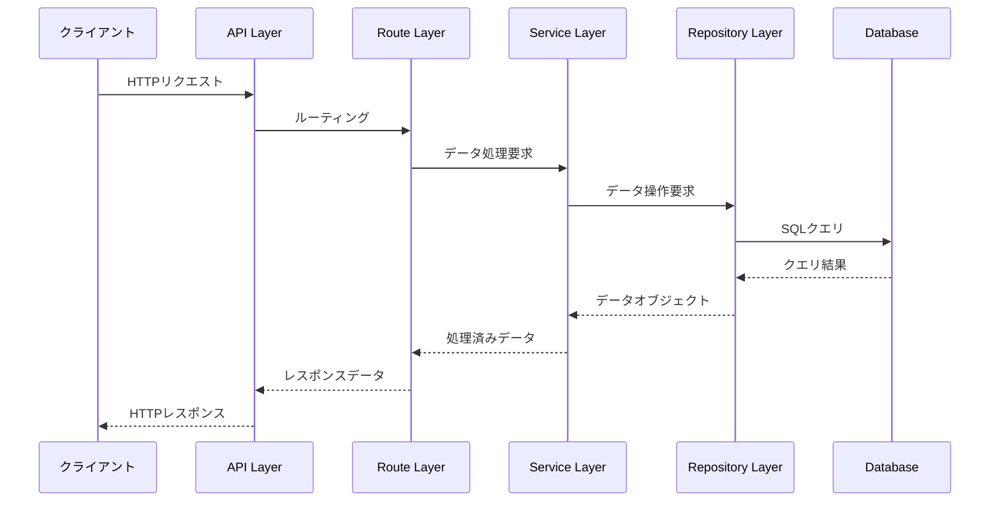
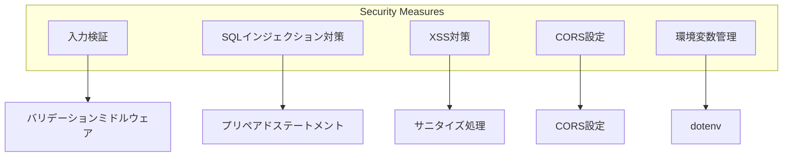

# アプリケーションアーキテクチャ

## システム概要図

## コンポーネント構成

## レイヤー別の責務

### API Layer

-   HTTP リクエスト/レスポンスの処理
-   CORS の設定
-   グローバルエラーハンドリング
-   リクエストボディのパース

### Route Layer

-   URL ルーティング
-   リクエストの検証
-   レスポンスの整形
-   エラーハンドリング

### Service Layer

-   ビジネスロジックの実装
-   トランザクション管理
-   データの加工
-   バリデーション

### Repository Layer

-   データベース操作の抽象化
-   SQL クエリの実行
-   データの永続化
-   エンティティの管理

## データフロー

## セキュリティ対策

